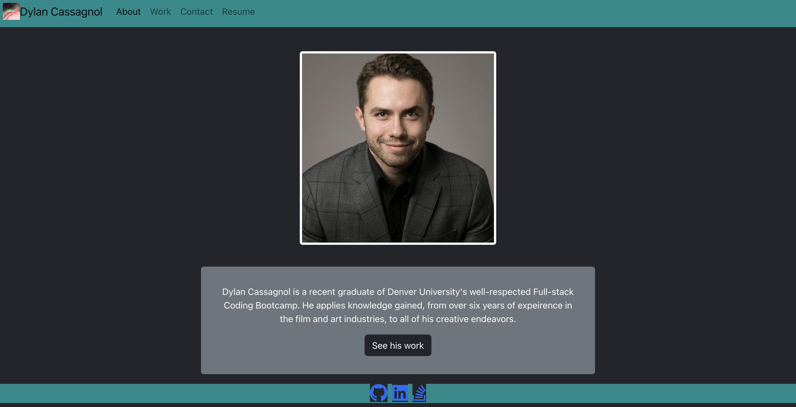

# Dylan Cassagnol React Portfolio

## Screenshot of Application

## Table of Contents: 
[Description](#description)

[Installation](#installation)

[Usage](#usage)

[Contributions](#contributions)

[License](#license)

[Questions](#questions)

## Description: 
A front-end application that displays my skills with components and state variables and presents my information in a clear stylized format.

## Installation: 
You can download a copy of my resumé by clicking the download resumé pdf button in the resume tab.

## Usage: 
This application can be used to view Dylan Cassagnol's portfolio of projects. There is also links to his github, linkedIn, and Stack Overflow pages. There is also a contact page that can be used to get in touch with Dylan.

## Contributions: 
N/A

## License: 
N/A

## Questions: 
Github Username: https://github.com/darthcurtiscass

Email: dylancurtiscassagnol@icloud.com
